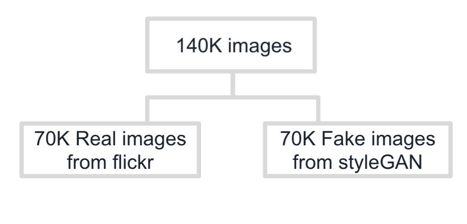
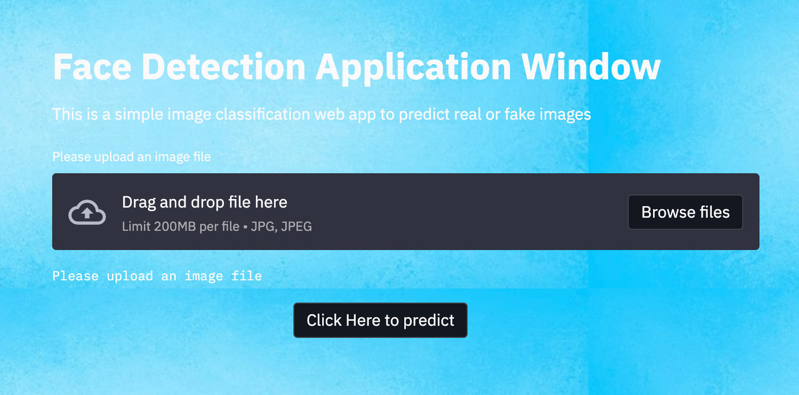

# Real or Fake Face Detection using Deep Learning

## Introduction

This project focuses on building a deep neural convolution network for the identification of real or fake faces. With the rapid development in GANs it became easy to generate fake faces and videos which brings the threats like identity theft and privacy breaches. Hence neural network plays a major role as they automatically detects the important features without any human supervision.

## Business Problem

It's obvious that the cybercrime is the most known issue in this today's digital world. Biometrics face recognition is now emerging as many companies are now using it as a viable security solution offered by machine learning engineers.

One of the leading corporate company who provide softwares for the The United States Department of Homeland Security wants to build a secured complex neural network for the facial recognition systems which could be used by the border patrols.

## The Data

The dataset used in this project is from kaggle. This dataset consists of all 70k REAL faces from the Flickr dataset collected by Nvidia, as well as 70k fake faces sampled from the 1 Million FAKE faces (generated by StyleGAN) that was provided by Bojan.

The source of the data can be found in the following link (https://www.kaggle.com/xhlulu/140k-real-and-fake-faces)

## Analysis

A deep convolution neural network is built to identify the real or fake image from the dataset . Based on that 5 different neural network with  parameter tunning was built to improve the model performance.

The entire code and feauture engineering model work can be found as follows:

* Go to GitHub id @JanakiGanesh
* Select the repository name (Real-or-Fake-Face-Detection-using-Deep-Learning)
* Navigate to JupyterNotebook/ subfolder in the Real-or-Fake-Face-Detection-using-Deep-Learning repository
* Click the file name (Real_Fake_Face_Detection_using_Deep_Learning.ipynb) to view the jupyter notebbok
* To view the project presentation, select presentation/ subfolder in the Real-or-Fake-Face-Detection-using-Deep-Learning repository

## Streamlit App
 The web application was built where user uploads the 'jpg' or 'png' image and on clicking the predict button they immediately receive the status of the image whether they are fake or real image.

 For the app, saved weights of the best model was loaded to the CNN arthitecture. Then, the user input was passed to the data iterator method of Keras data generator object, finally evaluated by the model to generate predicted probabilities of each of the two classes.

 Here is the link to access the app (https://share.streamlit.io/janakiganesh/streamlitapp/main/app.py)

 

## For More Information

For any further informations , contact Janaki at janakipurushothamman@gmail.com

## Repository Structure

├── image                   
├── jupyternotebook                  
├── presentation                  
├── README.md

